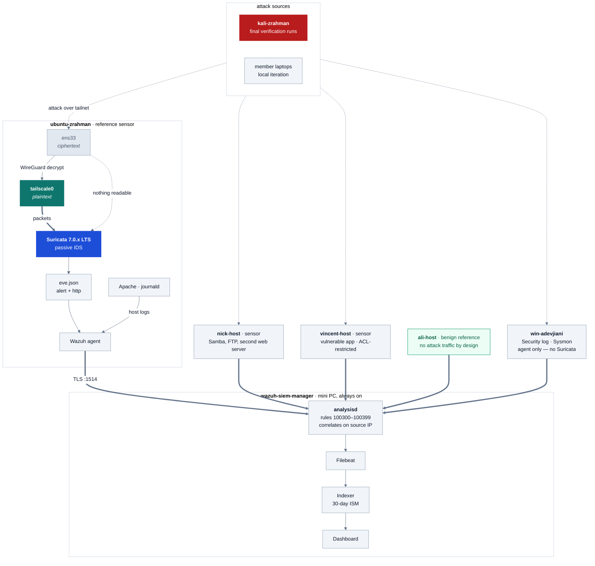

# Phase 1.5 Architecture — Suricata NIDS on a Tailscale mesh

Two renderings of the same architecture. The Mermaid block renders automatically
on GitHub; the ASCII block is for terminals, plain-text docs, and anywhere
Mermaid is unavailable.

**The one thing the diagram is built to show:** `ens33` receives only ciphertext,
because the WireGuard tunnel has not yet terminated. `tailscale0` carries
plaintext, because it has. That is why every sensor sits on the host it monitors
rather than on a tap or a SPAN port — the mesh provides no midpoint where traffic
is readable.

---

## Rendered



---

## ASCII

```
 ATTACK SOURCES
 ---------------------------------------------------------------------------
   kali-zrahman .... final verification runs; the source cited in writeups
   member laptops .. local iteration during development
                            |
                            |  over the Tailscale mesh
                            v

 HOSTS
 ---------------------------------------------------------------------------
   HOST             ROLE                            ATTACKED   SURICATA
   ubuntu-zrahman   reference build; Apache, journald   yes       yes
   nick-host        Samba, FTP, second web server       yes       yes
   vincent-host     vulnerable app, ACL-restricted      yes       yes
   ali-host         benign reference host               NO        yes
   win-adevjiani    Security log, Sysmon                yes       NO

   ali-host receives no attack traffic by design. Any rule that fires
   against it is a false positive, which makes it the measurement target
   for baselining.

   win-adevjiani runs no sensor: npcap cannot enumerate WinTun adapters,
   so Suricata cannot capture tailnet traffic on Windows.


 CAPTURE PATH  (identical on all four sensor hosts)
 ---------------------------------------------------------------------------

                          attack traffic
                                |
                                v
              +----------------+   WireGuard   +----------------+
              |     ens33      |-------------->|   tailscale0   |
              |   CIPHERTEXT   |    decrypt    |   PLAINTEXT    |
              +----------------+               +----------------+
                       :                                |
                       : nothing readable               | packets
                       :                                v
                       :                  +---------------------------+
                       '----------------->|    Suricata 7.0.x LTS     |
                                          |    passive IDS, no IPS    |
                                          +---------------------------+
                                                        |
                                                        v
                                             eve.json (alert + http)
                                                        |
              Apache, journald, Samba, etc. ----------->+
                                                        |
                                                        v
                                                  Wazuh agent
                                                        |
                                         TLS :1514 over the tailnet
                                                        |
                                                        v

 MANAGER   wazuh-siem-manager -- mini PC, always on
 ---------------------------------------------------------------------------

     analysisd  ---->  Filebeat  ---->  Indexer  ---->  Dashboard
         |                                 |
         |                                 +-- 30-day ISM retention
         |
         +-- custom rules 100300-100399
         +-- correlates network alerts with host logs on source IP
```

---

## Why the sensor sits on the endpoint

A SPAN port or network tap copies whatever is on the wire. On this lab's wire,
that is WireGuard-encrypted UDP, so a tap would mirror ciphertext. The tunnel
decrypts only at each node, which makes `tailscale0` the sole readable capture
point. Cloud and zero-trust environments encounter the same constraint and
resolve it the same way, by placing sensors on endpoints rather than at a
perimeter.

Accepted limitations:

| Limitation | Cause |
| --- | --- |
| Each sensor observes one host | Host-resident placement |
| Sensor shares fate with its host | Host compromise compromises the sensor |
| No L2, ARP, or VLAN visibility | `tailscale0` uses a RAW datalink, no Ethernet header |
| 1280-byte MTU | Tailscale tunnel overhead |
| Passive IDS only, no IPS | A mesh endpoint has no traffic-forwarding position |
| No Windows sensor | Npcap does not support WinTun adapters |
